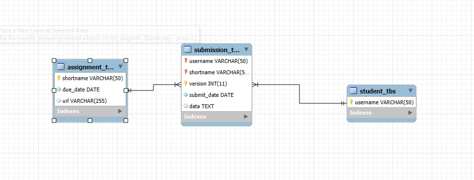

# Finals Lab Task 2 - Transforming ER into Relational Tables

## Task 1 - Query Statements

SELECT * FROM student_tbs;

SELECT * FROM assignment_tbs;

SELECT * FROM submission_tbs;

## Task 2 - Table Structure 

CREATE DATABASE schoolwork_db;
USE schoolwork_db;

CREATE TABLE student_tbs (
    username VARCHAR(50) PRIMARY KEY
);

CREATE TABLE assignment_tbs (
    shortname VARCHAR(50) PRIMARY KEY,
    due_date DATE NOT NULL,
    url VARCHAR(255) DEFAULT NULL
);

CREATE TABLE submission_tbs (
    username VARCHAR(50),
    shortname VARCHAR(50),
    version INT,
    submit_date DATE NOT NULL,
    data TEXT,
    PRIMARY KEY (username, shortname, version),
    FOREIGN KEY (username) REFERENCES student_tbs(username)
        ON DELETE CASCADE ON UPDATE CASCADE,
    FOREIGN KEY (shortname) REFERENCES assignment_tbs(shortname)
        ON DELETE CASCADE ON UPDATE CASCADE
);

INSERT INTO student_tbs (username) 
VALUES ('Kaloy'), ('Noel');

INSERT INTO assignment_tbs (shortname, due_date, url) 
VALUES 
('MATH101', '2025-04-30', 'http://assignments.com/math101'),
('SCI202', '2025-05-10', 'http://assignments.com/sci202');

INSERT INTO submission_tbs (username, shortname, version, submit_date, data) 
VALUES 
('Kaloy', 'MATH101', 1, '2025-04-25', 'First submission by Kaloy'),
('Kaloy', 'MATH101', 2, '2025-04-25', 'Updated submission by Kaloy'),
('Noel', 'SCI202', 1, '2025-04-25', 'Submission by Noel');

## Task 3 -  ER Diagram or Relational schema from phpMyAdmin or Workbench

 

## Task 4 - Sql copy of the database and table structures

[Raw Copy of MySQL File](https://github.com/MassStarvation01/Anaya_Portfolio/blob/main/Finals_Task-2/Files/kaloy_ft2.sql)

CREATE DATABASE schoolwork_db;
USE schoolwork_db;

CREATE TABLE student_tbs (
    username VARCHAR(50) PRIMARY KEY
);

CREATE TABLE assignment_tbs (
    shortname VARCHAR(50) PRIMARY KEY,
    due_date DATE NOT NULL,
    url VARCHAR(255) DEFAULT NULL
);

CREATE TABLE submission_tbs (
    username VARCHAR(50),
    shortname VARCHAR(50),
    version INT,
    submit_date DATE NOT NULL,
    data TEXT,
    PRIMARY KEY (username, shortname, version),
    FOREIGN KEY (username) REFERENCES student_tbs(username)
        ON DELETE CASCADE ON UPDATE CASCADE,
    FOREIGN KEY (shortname) REFERENCES assignment_tbs(shortname)
        ON DELETE CASCADE ON UPDATE CASCADE
);

INSERT INTO student_tbs (username) 
VALUES ('Kaloy'), ('Noel');

INSERT INTO assignment_tbs (shortname, due_date, url) 
VALUES 
('MATH101', '2025-04-30', 'http://assignments.com/math101'),
('SCI202', '2025-05-10', 'http://assignments.com/sci202');

INSERT INTO submission_tbs (username, shortname, version, submit_date, data) 
VALUES 
('Kaloy', 'MATH101', 1, '2025-04-25', 'First submission by Kaloy'),
('Kaloy', 'MATH101', 2, '2025-04-25', 'Updated submission by Kaloy'),
('Noel', 'SCI202', 1, '2025-04-25', 'Submission by Noel');

SELECT * FROM student_tbs;

SELECT * FROM assignment_tbs;

SELECT * FROM submission_tbs;

