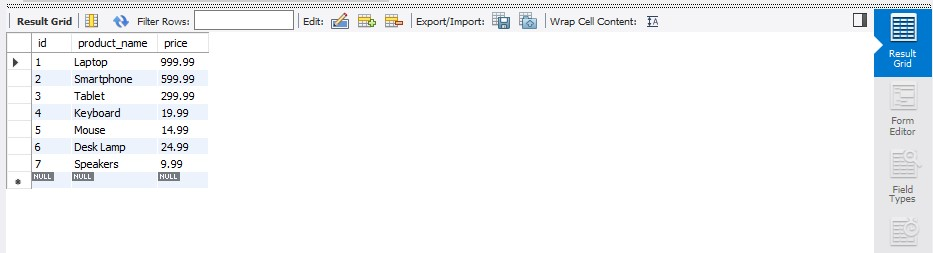

# Finals Task 3 - Table Manipulation

## Task 1 - Query Statements

DESCRIBE products_tb;

SELECT * FROM products_tb;

## Task 2 - Table Structure

CREATE DATABASE product_db;

USE product_db;

CREATE TABLE products_tb (
    id INT AUTO_INCREMENT PRIMARY KEY,
    product_name VARCHAR(100) NOT NULL,
    price DECIMAL(10, 2)
);

ALTER TABLE products_tb
ADD CONSTRAINT chk_price CHECK (price > 0);

INSERT INTO products_tb (product_name, price)
VALUES
    ('Laptop', 999.99),
    ('Smartphone', 599.99),
    ('Tablet', 299.99),
    ('Keyboard', 19.99),
    ('Mouse', 14.99),
    ('Desk Lamp', 24.99),
    ('Speakers', 9.99);

ALTER TABLE products_tb
MODIFY COLUMN product_name VARCHAR(120) NOT NULL;

## Task 3 - Relational Schema for Products Table

 

## Task 4 - SQL Copy of the Database and Table Structures

[Raw Copy of MySQL File](https://github.com/MassStarvation01/Anaya_Portfolio/blob/main/Finals_Task-3/Files/kaloy_ft3.sql)

CREATE DATABASE product_db;

USE product_db;

CREATE TABLE products_tb (
    id INT AUTO_INCREMENT PRIMARY KEY,
    product_name VARCHAR(100) NOT NULL,
    price DECIMAL(10, 2)
);

ALTER TABLE products_tb
ADD CONSTRAINT chk_price CHECK (price > 0);

INSERT INTO products_tb (product_name, price)
VALUES
    ('Laptop', 999.99),
    ('Smartphone', 599.99),
    ('Tablet', 299.99),
    ('Keyboard', 19.99),
    ('Mouse', 14.99),
    ('Desk Lamp', 24.99),
    ('Speakers', 9.99);

ALTER TABLE products_tb
MODIFY COLUMN product_name VARCHAR(120) NOT NULL;

DESCRIBE products_tb;

SELECT * FROM products_tb;

