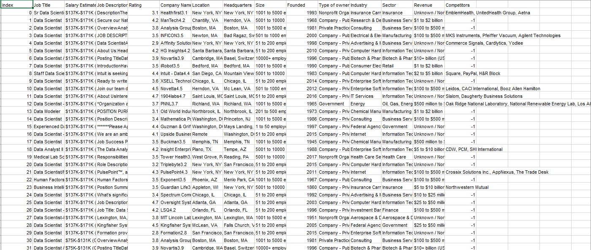

# Midterm Lab Task 2 – Data Cleaning and Transformation Using Power Query Editor

You are provided with the `Uncleaned_DS_jobs.csv` dataset (sourced from Kaggle). The objective is to clean and transform this dataset using **Power Query Editor in Excel** to extract meaningful insights.

---

## STEP 1 – Data Cleaning

1. **Load the Dataset**
   - Import the raw CSV file into Excel using Power Query Editor.

2. **Adjust Layout**
   - Resize column widths and row heights to properly display the data.

3. **Remove Extra Spaces**
   - Use the `Trim` function to eliminate leading and trailing spaces from text fields.

4. **Handle Missing Values**
   - Remove rows containing `null` or missing values.

5. **Remove Duplicates**
   - Remove any duplicate rows to ensure data consistency.

---

## STEP 2 – Data Transformation

1. **Clean the `Salary Estimate` Column**
   - Select the `Salary Estimate` column.
   - Use:
     - `Transform > Extract > Text Before Delimiter`
     - Remove any content after the opening parenthesis `(`.

2. **Create `Min Salary` and `Max Salary` Columns**
   - Go to:
     - `Add Column > Column from Examples`
     - Extract minimum and maximum salary values from the cleaned `Salary Estimate` column.

3. **Add a Role Type Classification Column**
   - Go to:
     - `Add Column > Custom Column`
     - Create a column that categorizes job titles into roles like:
       - Data Scientist
       - Data Analyst
       - Data Engineer
       - Etc.

4. **Split the `Location` Column**
   - Select the `Location` column.
   - Use:
     - `Transform > Split Column by Delimiter`
     - Choose comma `,` as the delimiter to separate into components (e.g., City and State).

5. **Standardize Location Names**
   - Create a custom column to replace full state names with abbreviations:
     - `New Jersey` → `NJ`
     - `California` → `CA`

6. **Filter Out Invalid Data**
   - Remove rows with negative values in the `Competitors` and `Industry` columns.

7. **Clean the `Company Name` Column**
   - Use:
     - `Transform > Replace Values` or `Remove Text`
     - Remove unnecessary characters or strings (e.g., ratings, symbols) from company names.

## STEP 3 – Screenshots

Before Data Cleaning:
(See screenshot of raw data before any transformations were made.)

 

[*Here's the raw file*](https://github.com/NaythanIsME/EDM-Portfolio/blob/main/Midterm%20Task%202/Files/Uncleaned_DS_jobs.xlsx)

After Data Cleaning:
(See screenshot of cleaned data post-transformation.)

 

[*Here's the cleaned file*](https://github.com/NaythanIsME/EDM-Portfolio/blob/main/Midterm%20Task%202/Files/NathanielLimiac_task2.xlsx)

## STEP 4 – Final Output Queries
Here are the final queries after performing all necessary data transformations:

Sal By Role Type dup: A query with job titles categorized by role type.

 

Sal By Size ref: A query focusing on salary data by company size or another metric.

 

Sal By State ref: A query analyzing salary data by state/location.

 

Uncleaned DS Jobs: The original dataset before any transformations.

 

## Physical Data Model
(Insert physical data model screenshot here)

 
