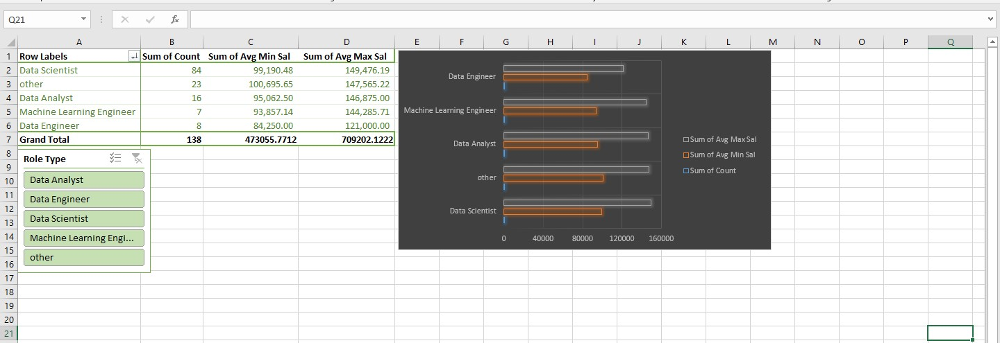
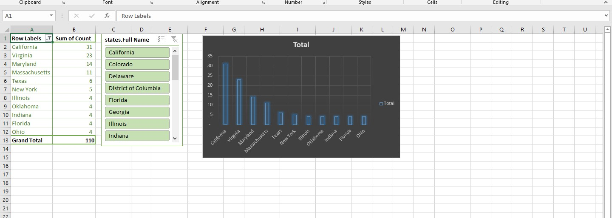
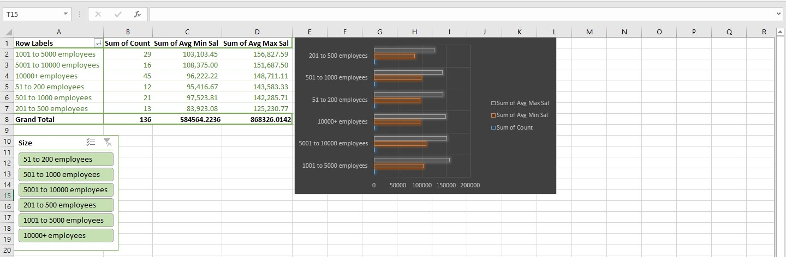
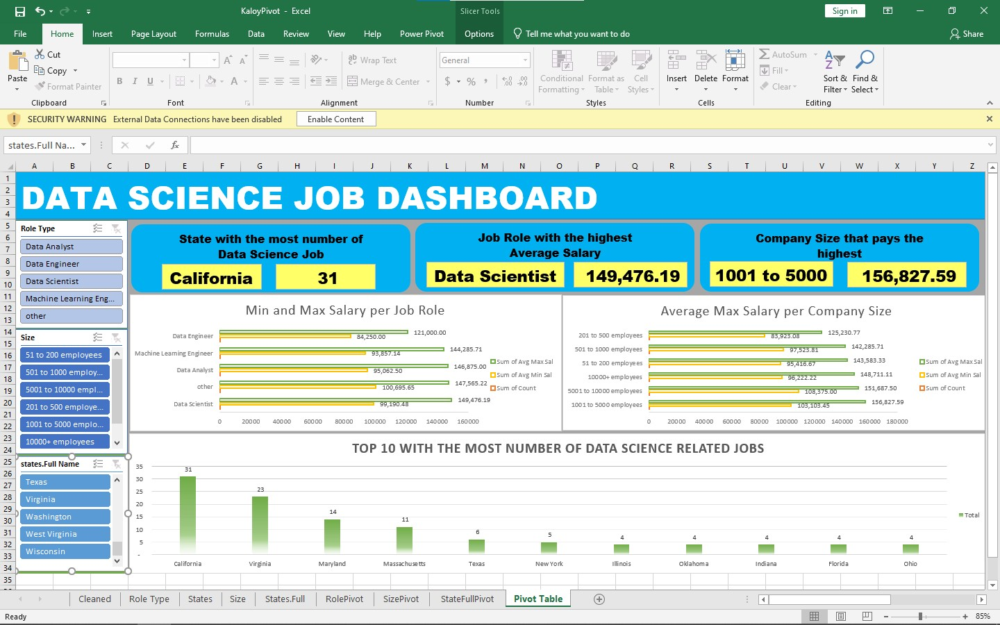
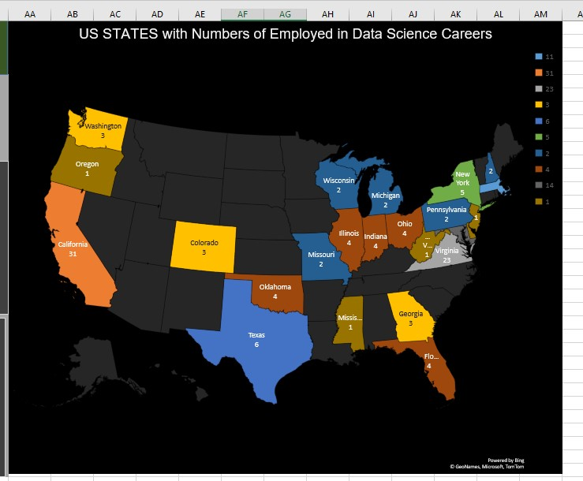

# Midterm Lab Task 3 – Creating Pivot Table and Dashboard

This task focuses on building an interactive Dashboard using Pivot Tables, Charts, and Slicers in Excel. Follow the steps below to create a dynamic and visually informative dashboard.

---

## Step 1 – Data Preparation

- **Load Data**: Open the worksheet containing the transformed tables from the `Uncleaned_DS_Jobs` dataset.

---

## Step 2 – Pivot Table Creation

1. **Salary by Role**

   

2. **Salary by State**

   

3. **Salary by Size**

   

---

## Step 3 – Design Your Dashboard

### Insert Charts:

- **Salary by Role Chart**  
  Select the PivotTable for Salary by Role → go to `Insert > Recommended Charts` → choose a Bar Chart or Column Chart.

- **Salary by State Chart**  
  Select the PivotTable for Salary by State → insert a Bar or Column Chart.

- **Salary by Size Chart**  
  Use a Pie Chart or Bar Chart based on your Salary by Size PivotTable.

### Insert Map Chart (Optional):

- Select the State and Salary data from your PivotTable → go to `Insert > Maps > Filled Map`.  
  Ensure state names are recognized by Excel to generate the map.

---

## Step 4 – Insert Slicers for Interactivity

- Select a PivotTable (e.g., Salary by Role) → go to `Insert > Slicer`.
- Choose filter fields such as:
  - State
  - Company Size
  - Role
- Repeat slicer insertion for other PivotTables as needed.

---

## Step 5 – Apply Design and Color Customizations

- **Color Customization**:  
  Go to `Home > Cell Styles` or manually format chart elements.

- **Chart Design**:  
  Select a chart → go to `Chart Tools > Design` to modify styles.

---

## Step 6 – Make the Dashboard Interactive

- **Connect Slicers**:  
  Right-click a slicer → select `Report Connections` → check all PivotTables to sync filtering.

- **Test Interactivity**:  
  Click slicer buttons to confirm that charts update accordingly.

---

## Step 7 – Insert the Final Dashboard

---

## Step 8 – Insert Map

---

[**📂 Download the Excel File**](https://github.com/MassStarvation01/Anaya_Portfolio/blob/main/Midterm_Task-3/Files/KaloyPivot.xlsx)
